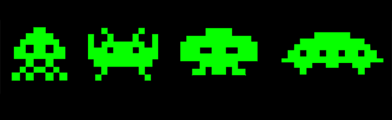

I created this program initially as my final project for ICS 111. Since it was for an introductory computer science course and I was new to programming, my goals for the project started as rather basic. The basic functionality I wanted was the ability for a tank to move, shoot, and be hit/killed and for aliens to advance down the screen dropping bombs. I found that I was able to achieve this relatively easily by tracking each on-screen object’s location and direction.

After submitting the project, I returned to try to make more ambitious improvements. I wanted to introduce a level system, different enemy types, and power up drops. I found that the way I had initially structured the code made it a little difficult to make large changes. Due to my inexperience coding, my code wasn’t very modular, requiring me to redesign/rewrite large portions of it.

This project taught me quite a bit about the necessity of writing code that is easily expandable. It was a valuable lesson in the importance of initial design decisions and the impact they can have on the scalability of a project. Since then, skills learned from building this game have saved me hours of time and many headaches.
